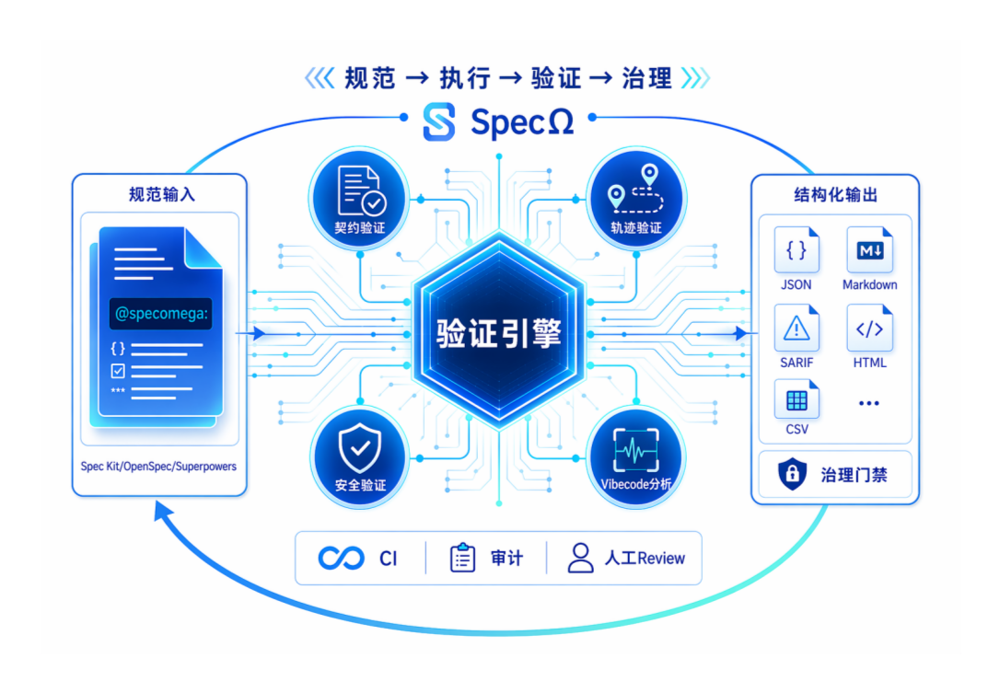
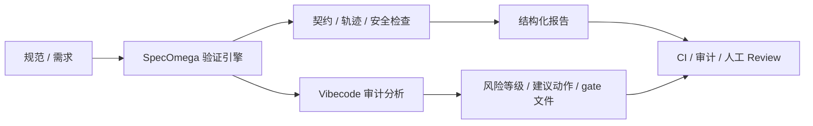

# SpecOmega

[](https://github.com/cloudsoa/specomega/actions/workflows/ci.yml)
[](LICENSE)



SpecOmega 是一个面向“规范 - 执行 - 验证 - 治理”闭环的工程中枢。它把规范、Agent 执行和生成式代码风险串成一条可验证、可审计、可落地的工程链路。你可以把它理解为：在 Spec Kit / OpenSpec / Superpowers 之外，再加一层“执行与治理的校验中枢”。

如果你正在做规范驱动开发、Agent 协作治理，或是想把 AI 生成代码纳入正式审计流程，SpecOmega 可以作为你的一条可落地的工程桥梁。

## 为什么值得使用

- 把规范、执行和治理串成一条可验证的闭环
- 把多 Agent 协作中的交接规则变成可执行契约
- 把生成式代码与模板化代码风险变成可审计的治理结果

## 快速开始

如果你只是想先看一下这个项目能做什么，建议按下面的顺序体验：

```bash
python -m specomega --version
python -m specomega info
python -m specomega verify --path .
python -m specomega vibecode --paths docs specomega --output-dir .specomega/reports
```

这条路径会先确认 CLI 可用，再完成一次规范验证和一次 Vibecode 审计，适合首次接触项目时快速建立信心。

## 典型工作流

- 首次使用：`python -m specomega info`
- 本地开发验证：`python -m specomega verify --path .`
- 审计式检查：`python -m specomega vibecode --paths docs specomega --output-dir .specomega/reports`
- CI 集成：`python -m specomega vibecode --paths docs specomega --output-dir .specomega/reports --format sarif --strict`

## 你可以先做的 3 件事

1. 先跑一次 CLI 基础检查：`python -m specomega info`
2. 再跑一次规范验证：`python -m specomega verify --path .`
3. 最后看一遍 Vibecode 审计输出：`python -m specomega vibecode --paths docs specomega --output-dir .specomega/reports`

## 核心能力

- 规范片段验证：把 `@specomega:` 标记的规则变成可执行检查
- Agent 运行追踪分析：检查工具调用顺序、状态流转与风险前置步骤
- 多 Agent 协作契约：用 `@agent`、`@handoff`、`@phase`、`@retry`、`@fallback` 与 `@join` 约束角色、交接与流程语义
- Vibecode 审计与治理：识别生成式代码与模板化代码风险，并输出可审查、可阻断的治理结果
- 报告输出：支持 JSON / Markdown / SARIF / HTML / CSV 输出，适配 CI、审计和人工 Review

## 项目定位

SpecOmega 的核心价值在于弥合“规范定义”与“代码执行”之间的验证鸿沟：

> 让规范从“可讨论的文档”变成“可验证的工程资产”，并为多 Agent 协同与生成式代码治理提供可执行的流程契约。

## 当前能力

当前仓库已经包含一个可运行的工程化实现，提供：

- 统一验证引擎
- 基于 `@specomega:` 标记的规范验证
- 契约验证器：`contract_check`
- 执行轨迹验证器：`trace_check`
- 安全规则验证器：`security_check`
- 配置驱动的验证器加载
- 多 Agent 工作流编排与交接契约检查，包含阶段、依赖、重试、回退与汇聚点评估
- Vibecode 分析器：自动识别关键词、来源类型、生成行为、痕迹、意图/目标、动态规则、证据分解与来源线索
- 政策驱动的治理门禁：可基于配置决定是否阻断流程
- CLI 入口与多格式报告输出：JSON / Markdown / SARIF / HTML / CSV 均可携带证据分解与 Provenance 信息
- 运行时可选的 LLM 风险摘要与本地规则兜底，适配 CI、审计与人工 review 流程
- 可输出结构化报告与治理 gate 文件，便于持续集成与审批流水线接入

## 适用场景

- 规范与代码一致性验证
- Spec Kit / OpenSpec / Superpowers 的补充验证层
- 多 Agent 任务的角色与交接规范化
- CI/CD、审计与 Review Gate 的自动化前置检查
- 生成式代码、模板脚手架与 AI 辅助代码的治理审查

## 适合谁使用

- 想把“规范文档”变成“可执行工程契约”的团队
- 需要在多 Agent 协作中约束角色、交接和回退规则的开发组织
- 希望把 AI 生成代码风险纳入 CI 与审计流程的工程负责人
- 想把规范、执行与治理串成一条闭环的技术负责人或平台团队

## 项目状态与可验证性

当前仓库已经具备可直接运行的基线能力，判断项目状态的最简单方式是执行以下命令：

```bash
python -m specomega --version
python -m specomega info
python -m unittest discover -s tests -v
```

如果这些命令都能正常返回，说明当前项目已经具备可用的 CLI、测试基线和基本工程可验证性。

## 目录结构

- [specomega](specomega)：核心包
- [tests](tests)：回归测试
- [openspec/specs](openspec/specs)：示例 OpenSpec 规范
- [.specomega](.specomega)：验证策略配置、治理规则与多 Agent 示例
- [docs](docs)：架构、使用手册与协作契约文档

## 文档索引

### 中文文档
- [docs/quickstart.md](docs/quickstart.md)：快速上手指南
- [docs/developer-guide.md](docs/developer-guide.md)：开发者指南
- [docs/architecture.md](docs/architecture.md)：架构与职责说明
- [docs/architecture-flow.md](docs/architecture-flow.md)：流程图与示例说明
- [docs/user-guide.md](docs/user-guide.md)：使用手册
- [docs/vibecode-governance.md](docs/vibecode-governance.md)：Vibecode 审计与治理说明
- [docs/sdd-agent-contract.md](docs/sdd-agent-contract.md)：SDD 与多 Agent 协作契约
- [docs/example-agent-runtime.md](docs/example-agent-runtime.md)：Agent 示例落地说明
- [docs/ai-risk-analysis.md](docs/ai-risk-analysis.md)：AI 风险分析与优化建议
- [docs/release-notes.md](docs/release-notes.md)：发布说明
- [docs/release-notes.en.md](docs/release-notes.en.md)：Release notes
- [docs/project-overview.md](docs/project-overview.md)：项目定位说明
- [docs/llm-mode-configuration.md](docs/llm-mode-configuration.md)：大模型/工程模式配置说明
- [CHANGELOG.md](CHANGELOG.md)：版本变更记录

### English Docs
- [docs/quickstart.en.md](docs/quickstart.en.md)：Quickstart guide
- [docs/developer-guide.en.md](docs/developer-guide.en.md)：Developer guide
- [docs/architecture.en.md](docs/architecture.en.md)：Architecture overview
- [docs/architecture-flow.md](docs/architecture-flow.md)：Flow and example walkthrough
- [docs/user-guide.en.md](docs/user-guide.en.md)：User guide
- [docs/vibecode-governance.en.md](docs/vibecode-governance.en.md)：Vibecode audit and governance guide
- [docs/sdd-agent-contract.en.md](docs/sdd-agent-contract.en.md)：SDD and multi-agent contract
- [docs/example-agent-runtime.en.md](docs/example-agent-runtime.en.md)：Agent runtime example guide
- [docs/ai-risk-analysis.en.md](docs/ai-risk-analysis.en.md)：AI risk analysis guide
- [docs/release-notes.en.md](docs/release-notes.en.md)：Release notes
- [docs/release-notes.md](docs/release-notes.md)：正式发布说明模板（包含兼容性、迁移和检查清单）
- [docs/project-overview.en.md](docs/project-overview.en.md)：Project overview
- [docs/llm-mode-configuration.en.md](docs/llm-mode-configuration.en.md)：LLM / engineering mode configuration

## 快速使用

### 贡献与开发入口

如果你希望参与开发、提交修复或扩展能力，请先查看 [CONTRIBUTING.md](CONTRIBUTING.md)；其中包含从 CLI 检查、测试执行到提交前验证的完整路径。

建议的开发者起步路径如下：

```bash
python -m specomega info
python -m unittest discover -s tests -v
python examples/agent_runtime/run_example.py
python -m specomega verify --path .
```

这条路径能帮助你快速确认本地环境、测试基线、示例运行和规范验证链路都是正常的。

### 新手入门路径

如果你是第一次使用 SpecOmega，建议按这个顺序开始：

```bash
python -m specomega --version
python -m specomega info
python -m unittest discover -s tests -v
python examples/agent_runtime/run_example.py
```

这条路径会先确认 CLI 可用，再验证最小 Agent 示例，并建立一个可继续扩展的基础运行环境。完整步骤请参考 [docs/quickstart.md](docs/quickstart.md) 与 [docs/quickstart.en.md](docs/quickstart.en.md)。

### 运行 Agent 场景示例

```bash
python examples/agent_runtime/run_example.py
```

查看命令行元信息与版本：

```bash
python -m specomega --version
python -m specomega info
```

这条示例会读取 [examples/agent_runtime/spec.md](examples/agent_runtime/spec.md) 和 [examples/agent_runtime/agent_trace.json](examples/agent_runtime/agent_trace.json)，验证支付工具调用序列是否符合规范，并生成示例报告到 [.specomega/reports](.specomega/reports)。

首次运行时建议按顺序执行：

```bash
python -m unittest discover -s tests -v
python examples/agent_runtime/run_example.py
python -m specomega verify --path .
```

运行测试：

```bash
python -m unittest discover -s tests -v
```

执行规范验证：

```bash
python -m specomega verify --path .
```

默认会将结果写入 [.specomega/reports/latest.json](.specomega/reports/latest.json)；如需查看生成的报告目录，可直接浏览 [.specomega/reports](.specomega/reports)。

分析规范冲突：

```bash
python -m specomega analyze --path openspec/specs/user_management.md
```

识别 Vibecode 信号并生成审计报告：

```bash
python -m specomega vibecode "this repo uses vibecode workflow"
python -m specomega vibecode --paths docs specomega --output-dir .specomega/reports
python -m specomega vibecode "hello vibecode" --format sarif --output-dir .specomega/reports
python -m specomega vibecode "Generated by ChatGPT: def hello(): return 'hi'" --format html --output-dir .specomega/reports
```

可复用配置位于 [.specomega/vibecode_config.json](.specomega/vibecode_config.json)。它支持：

- 阈值配置
- 风险规则映射，如 `llm_generated` / `template_generated` / `handwritten`
- 动态规则配置（`patterns` / `weight` / `risk` / `actions` / `category` / `label`）
- 政策驱动的 `block_on` 配置
- `repository_sources`：为本地 Git / 内部 Git / 私有仓库来源提供可配置的来源线索
- 证据分解与 Provenance 输出：便于审计与人工 Review 追踪生成链路
- 生成可供 CI、审计与人工 Review 使用的 gate 文件

CI 工作流已添加至 [.github/workflows/vibecode.yml](.github/workflows/vibecode.yml)，可在 GitHub Actions 中自动执行：

```bash
python -m specomega vibecode --paths docs specomega --output-dir .specomega/reports --format sarif --config .specomega/vibecode_config.json
```

当前会输出 severity（none/low/medium/high）信息，并在 JSON 结果中附带 `evidence_breakdown` 与 `provenance_hints`；同时生成：

- [.specomega/reports/vibecode_report.json](.specomega/reports/vibecode_report.json)
- [.specomega/reports/vibecode_report.md](.specomega/reports/vibecode_report.md)
- [.specomega/reports/vibecode_report.html](.specomega/reports/vibecode_report.html)
- [.specomega/reports/vibecode_report.csv](.specomega/reports/vibecode_report.csv)
- [.specomega/reports/vibecode_gate.txt](.specomega/reports/vibecode_gate.txt)

规划多 Agent 工作流：

```bash
python -m specomega plan --path .specomega/agents.md
```

执行 AI 风险分析：

```bash
python -m specomega risk --spec examples/agent_runtime/spec.md --trace examples/agent_runtime/agent_trace.json --output-dir .specomega/reports
```

若在 CI 中希望在发现告警时失败构建，可使用：

```bash
python -m specomega risk --spec examples/agent_runtime/spec.md --trace examples/agent_runtime/agent_trace.json --output-dir .specomega/reports --format sarif --strict
```

## 设计定位

- Spec Kit：负责定义需求、验收标准与业务目标，体现需求工程与软件生命周期管理的规范化表达，通常对应 IEEE 29148 与 ISO/IEC/IEEE 12207 的实践思路。
- OpenSpec：负责把需求和变更意图拆成可追踪、可验证的规格草稿与交付契约，适合用于版本化变更、接口定义与规范落地。
- Superpowers：负责约束执行纪律，包括工具调用顺序、交接规则、权限边界与回退/重试机制，体现安全工程与运行治理的落地方法，通常与 NIST SSDF、ISO/IEC 27001 这类实践保持一致。
- SpecOmega：负责把上述三者的输入转成机器可执行的验证与审计证据，确保“规范、实现与执行行为”保持一致，并在 CI、审计与审批流程中生成结构化输出。

### 三者如何协同

从工程实践视角看，这三个工具构成了从“定义需求”到“执行交付”再到“验证治理”的闭环：

1. Spec Kit 定义“应该做什么”和“如何判定成功”。
2. OpenSpec 将这些目标拆成可追踪、可验证的变更规格与契约。
3. Superpowers 约束执行过程中角色、工具调用和安全边界。
4. SpecOmega 将规范、实现与运行轨迹进行一致性检查，并产出报告、SARIF、Markdown 与治理 gate 文件。

这套协同方式非常适合于多 Agent 场景、生成式代码治理与审计导向的工程组织，能够把需求、设计、执行和审计真正串成一条连续的工程链路。

## 运行流程示意



## 多 Agent 与 SDD 方向

当前实现已经把 SpecOmega 的能力扩展到一个可验证的 SDD 风格协同层：

- 使用 `@agent:` 声明角色
- 使用 `@handoff:` 声明角色之间的交接契约
- 使用 `@phase:`、`@retry:`、`@fallback:`、`@join:` 为工作流补充阶段、重试、回退与汇聚信息
- 通过编排器检查交接是否存在缺失角色、依赖是否满足、流程是否具备基本可执行结构
- 作为验证与执行流程的统一入口，支撑多 Agent 任务的规范化执行与 CI 级审查
