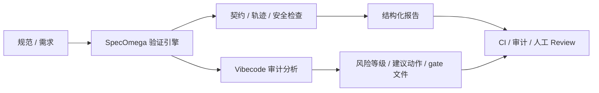

# SpecOmega

[](https://github.com/cloudsoa/specomega/actions/workflows/ci.yml)
[](LICENSE)

SpecOmega 是一个面向“规范 - 执行 - 验证 - 治理”闭环的轻量级工程中枢。它不替代 Spec Kit、OpenSpec 或 Superpowers 的主流程，而是为它们提供一个统一的验证与审计层：把规范中的可验证约束转成机器可执行的检查结果，并把多 Agent 协作中的交接规则与生成式代码风险变成可审计、可执行、可扩展的工程契约。

## 核心能力

- 规范片段验证：把 `@specomega:` 标记的规则变成可执行检查
- Agent 运行追踪分析：检查工具调用顺序、状态流转与风险前置步骤
- 多 Agent 协作契约：用 `@agent` 和 `@handoff` 约束角色与交接关系
- Vibecode 审计与治理：识别生成式代码与模板化代码风险，并输出可审查、可阻断的治理结果
- 报告输出：支持 JSON / Markdown / SARIF / HTML / CSV 输出，适配 CI、审计和人工 Review

## 项目定位

SpecOmega 的核心价值在于弥合“规范定义”与“代码执行”之间的验证鸿沟：

> 让规范从“可讨论的文档”变成“可验证的工程资产”，并为多 Agent 协同与生成式代码治理提供可执行的流程契约。

## 当前能力

当前仓库已经包含一个可运行的最小实现，提供：

- 统一验证引擎
- 基于 `@specomega:` 标记的规范验证
- 契约验证器：`contract_check`
- 执行轨迹验证器：`trace_check`
- 安全规则验证器：`security_check`
- 配置驱动的验证器加载
- 多 Agent 工作流编排与交接契约检查
- Vibecode 分析器：自动识别关键词、来源类型、置信度与证据
- 政策驱动的治理门禁：可基于配置决定是否阻断流程
- CLI 入口与多格式报告输出

## 适用场景

- 规范与代码一致性验证
- Spec Kit / OpenSpec / Superpowers 的补充验证层
- 多 Agent 任务的角色与交接规范化
- CI/CD、审计与 Review Gate 的自动化前置检查
- 生成式代码、模板脚手架与 AI 辅助代码的治理审查

## 目录结构

- [specomega](specomega)：核心包
- [tests](tests)：回归测试
- [openspec/specs](openspec/specs)：示例 OpenSpec 规范
- [.specomega](.specomega)：验证策略配置、治理规则与多 Agent 示例
- [docs](docs)：架构、使用手册与协作契约文档

## 文档索引

### 中文文档
- [docs/quickstart.md](docs/quickstart.md)：快速上手指南
- [docs/architecture.md](docs/architecture.md)：架构与职责说明
- [docs/architecture-flow.md](docs/architecture-flow.md)：流程图与示例说明
- [docs/user-guide.md](docs/user-guide.md)：使用手册
- [docs/vibecode-governance.md](docs/vibecode-governance.md)：Vibecode 审计与治理说明
- [docs/sdd-agent-contract.md](docs/sdd-agent-contract.md)：SDD 与多 Agent 协作契约
- [docs/example-agent-runtime.md](docs/example-agent-runtime.md)：Agent 示例落地说明
- [docs/ai-risk-analysis.md](docs/ai-risk-analysis.md)：AI 风险分析与优化建议
- [docs/release-notes.md](docs/release-notes.md)：发布说明
- [docs/project-overview.md](docs/project-overview.md)：项目定位说明
- [docs/llm-mode-configuration.md](docs/llm-mode-configuration.md)：大模型/工程模式配置说明
- [CHANGELOG.md](CHANGELOG.md)：版本变更记录

### English Docs
- [docs/quickstart.en.md](docs/quickstart.en.md)：Quickstart guide
- [docs/architecture.en.md](docs/architecture.en.md)：Architecture overview
- [docs/architecture-flow.md](docs/architecture-flow.md)：Flow and example walkthrough
- [docs/user-guide.en.md](docs/user-guide.en.md)：User guide
- [docs/vibecode-governance.en.md](docs/vibecode-governance.en.md)：Vibecode audit and governance guide
- [docs/sdd-agent-contract.en.md](docs/sdd-agent-contract.en.md)：SDD and multi-agent contract
- [docs/example-agent-runtime.en.md](docs/example-agent-runtime.en.md)：Agent runtime example guide
- [docs/ai-risk-analysis.en.md](docs/ai-risk-analysis.en.md)：AI risk analysis guide
- [docs/release-notes.en.md](docs/release-notes.en.md)：Release notes
- [docs/project-overview.en.md](docs/project-overview.en.md)：Project overview
- [docs/llm-mode-configuration.en.md](docs/llm-mode-configuration.en.md)：LLM / engineering mode configuration

## 快速使用

### 运行 Agent 场景示例

```bash
python examples/agent_runtime/run_example.py
```

这条示例会读取 [examples/agent_runtime/spec.md](examples/agent_runtime/spec.md) 和 [examples/agent_runtime/agent_trace.json](examples/agent_runtime/agent_trace.json)，验证支付工具调用序列是否符合规范，并生成示例报告到 [.specomega/reports](.specomega/reports)。

首次运行时建议按顺序执行：

```bash
python -m unittest discover -s tests -v
python examples/agent_runtime/run_example.py
python -m specomega verify --path .
```

运行测试：

```bash
python -m unittest discover -s tests -v
```

执行规范验证：

```bash
python -m specomega verify --path .
```

分析规范冲突：

```bash
python -m specomega analyze --path openspec/specs/user_management.md
```

识别 Vibecode 信号并生成审计报告：

```bash
python -m specomega vibecode "this repo uses vibecode workflow"
python -m specomega vibecode --paths docs specomega --output-dir .specomega/reports
python -m specomega vibecode "hello vibecode" --format sarif --output-dir .specomega/reports
python -m specomega vibecode "Generated by ChatGPT: def hello(): return 'hi'" --format html --output-dir .specomega/reports
```

可复用配置位于 [.specomega/vibecode_config.json](.specomega/vibecode_config.json)。它支持：

- 阈值配置
- 风险规则映射，如 `llm_generated` / `template_generated` / `handwritten`
- 政策驱动的 `block_on` 配置
- 生成可供 CI、审计与人工 Review 使用的 gate 文件

CI 工作流已添加至 [.github/workflows/vibecode.yml](.github/workflows/vibecode.yml)，可在 GitHub Actions 中自动执行：

```bash
python -m specomega vibecode --paths docs specomega --output-dir .specomega/reports --format sarif --config .specomega/vibecode_config.json
```

当前会输出 severity（none/low/medium/high）信息，并生成：

- [.specomega/reports/vibecode_report.json](.specomega/reports/vibecode_report.json)
- [.specomega/reports/vibecode_report.md](.specomega/reports/vibecode_report.md)
- [.specomega/reports/vibecode_report.html](.specomega/reports/vibecode_report.html)
- [.specomega/reports/vibecode_report.csv](.specomega/reports/vibecode_report.csv)
- [.specomega/reports/vibecode_gate.txt](.specomega/reports/vibecode_gate.txt)

规划多 Agent 工作流：

```bash
python -m specomega plan --path .specomega/agents.md
```

执行 AI 风险分析：

```bash
python -m specomega risk --spec examples/agent_runtime/spec.md --trace examples/agent_runtime/agent_trace.json --output-dir .specomega/reports
```

若在 CI 中希望在发现告警时失败构建，可使用：

```bash
python -m specomega risk --spec examples/agent_runtime/spec.md --trace examples/agent_runtime/agent_trace.json --output-dir .specomega/reports --format sarif --strict
```

## 设计定位

- Spec Kit / OpenSpec：定义规范与生成内容
- Superpowers：约束执行纪律
- SpecOmega：验证规范约束与实现证据是否一致

## 运行流程示意



## 多 Agent 与 SDD 方向

当前实现已经把 SpecOmega 的能力扩展到一个轻量的 SDD 风格协同层：

- 使用 `@agent:` 声明角色
- 使用 `@handoff:` 声明角色之间的交接契约
- 通过编排器检查交接是否存在缺失角色
- 作为验证与执行流程的统一入口，支撑多 Agent 任务的规范化执行
