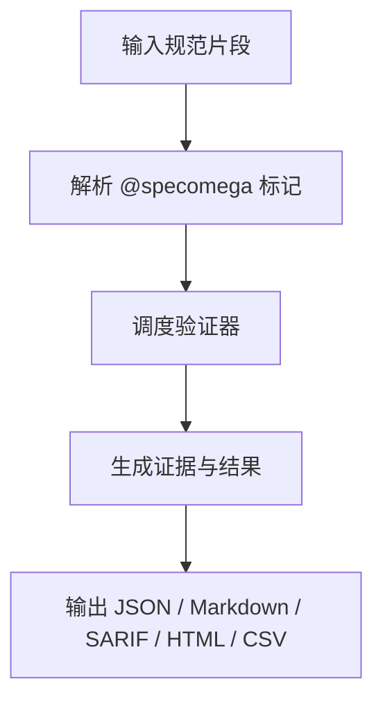
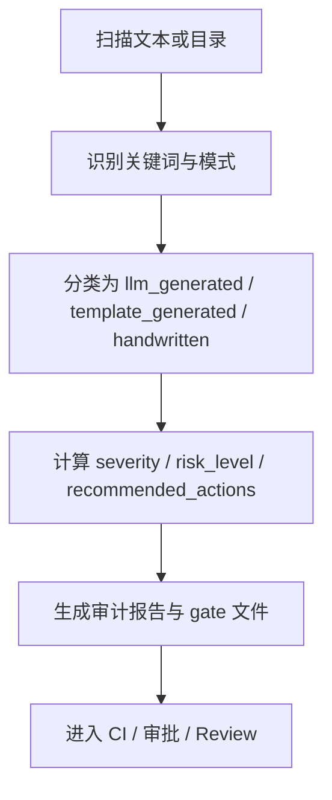

# SpecOmega 流程图与示例说明

## 1. 规范到验证的主流程

```mermaid
flowchart TD
    A[输入规范片段] --> B[解析 @specomega 标记]
    B --> C[调度验证器]
    C --> D[生成证据与结果]
    D --> E[输出 JSON / Markdown / SARIF / HTML / CSV]
```

## 2. Vibecode 治理流程

```mermaid
flowchart TD
    A[扫描文本或目录] --> B[识别关键词与模式]
    B --> C[分类为 llm_generated / template_generated / handwritten]
    C --> D[计算 severity / risk_level / recommended_actions]
    D --> E[生成审计报告与 gate 文件]
    E --> F[进入 CI / 审批 / Review]
```

## 3. 典型使用场景

- 规范校验：确认实现与规范约束一致
- 风险审查：在多 Agent 场景下发现潜在风险
- 生成式代码治理：识别 AI 辅助或模板化内容并做审批提示
- 审计归档：把结果落盘为可追踪的证据文件
